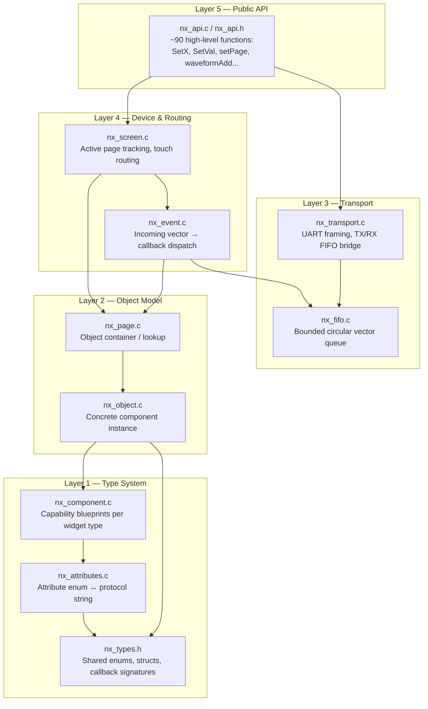

# Architecture

This document describes the internal design of the `lib/core` driver: how the layers fit together, why they're split the way they are, and the tradeoffs behind each decision.

## Layered Overview

The core is organized as five layers, each depending only on the layer(s) below it. Nothing in a lower layer ever calls back into a higher one (with the single exception of user-registered callbacks, which are intentionally the one place application code re-enters the driver).

---

## Layer 1 — Type System (`nx_types.h`, `nx_attributes.*`, `nx_component.*`)

**Purpose:** define *what a component is allowed to do*, independent of any specific screen or instance.

- `nx_types.h` is the single shared header: every enum (`NX_Type_t`, `NX_Status_t`, protocol command tables), every struct (`NX_Vector_t`, `NX_String_t`), and every callback function-pointer typedef used across the driver. Centralizing these avoids circular includes between the layers above.
- `nx_attributes.*` defines the ~60-member `NX_Attribute_t` enum (one entry per Nextion protocol attribute — `txt`, `bco`, `pco`, `val`, `x`, `y`, ...) and a static lookup table mapping each enum value to its literal wire-format string (e.g. `NX_ATTR_BCO` → `"bco"`). This is what lets the API render `object.attr=value` commands without ever hand-writing a string.
- `nx_component.*` defines one `NX_ComponentClass_t` **blueprint per widget type** (`nx_button`, `nx_text`, `nx_gauge`, `nx_waveform`, ...). Each blueprint carries a `uint64_t supportedAttributes` bitmask built from `NX_ATTR_BIT(NX_ATTR_X) | NX_ATTR_BIT(NX_ATTR_Y) | ...`. A static `NX_DB[NX_TYPE_MAX]` table maps `NX_Type_t` → blueprint pointer for O(1) lookup.

**Why a bitmask instead of a switch/case per type?** Adding a new attribute to a widget is a one-line change to its blueprint, and checking support is a single AND operation (`NX_ComponentHasAttribute`) instead of an ever-growing switch statement duplicated across every setter.

---

## Layer 2 — Object Model (`nx_object.*`, `nx_page.*`)

**Purpose:** represent *actual instances* placed on actual pages, and let the driver find them again from an event.

- `NX_Object_t` binds a component blueprint (Layer 1) to a concrete `pageId` + `componentId` + `objectName`, and carries the optional `onPress` / `onRelease` function pointers the application registers.
- `NX_Page_t` is a flat array of `NX_Object_t*` plus a `pageId`. Lookup by ID (`NX_PageFindObjectById`) is used on the hot path (touch event dispatch); lookup by name (`NX_PageFindObjectByName`) is available for dynamic/debug use.
- Both layers are entirely **static data** — pages and objects are meant to be generated once (typically by a project-specific parser tool reading the `.HMI` layout) and compiled into flash, not created at runtime.

---

## Layer 3 — Transport (`nx_fifo.*`, `nx_transport.*`)

**Purpose:** decouple the UART hardware timing from the application, and guarantee no partial/malformed frame reaches the wire.

- `NX_VectorFifo_t` is a fixed-depth (`NX_FIFO_DEPTH = 20`) circular buffer of `NX_Vector_t` (bounded byte arrays, max `NX_MAX_VECTOR_LEN = 128` bytes each). Push/pop are O(1) and defend against overflow/underflow, but note: **they are not interrupt-safe by themselves** — if you push from an ISR and pop from the main loop, guard the shared FIFO instance accordingly for your target's atomicity guarantees.
- `NX_Transport_t` owns one RX FIFO and one TX FIFO plus the two hardware function pointers (`tx_hardware_func`, `rx_hardware_func`) that bridge to your actual UART driver. This is the **only** place the core touches hardware, and it does so entirely through function pointers — `lib/core` contains **zero MCU-specific code**. Porting to a different microcontroller or toolchain never requires touching anything in `lib/core`; you only write a small adapter that fulfills these two callback signatures for your target's UART peripheral. The dsPIC33CH512MP508 / XC16 combination shipped in this repo's `lib/drivers/uart` is simply the platform this driver happened to be developed and validated against — not an architectural requirement.
- `NX_Transport_SendRaw` pops one vector from the TX FIFO, appends the mandatory 3×`0xFF` Nextion protocol terminator, and hands the complete frame to the hardware TX callback in one call — the wire never sees a partial command.
- `NX_Transport_Tasks` is the single function your periodic timer/ISR should call: it drains one pending RX vector into the event dispatcher and flushes one pending TX vector to the wire per call.

---

## Layer 4 — Device & Routing (`nx_screen.*`, `nx_event.*`)

**Purpose:** own "what page is active right now" and turn a raw incoming vector into a fired callback.

- `NX_Screen_t` is the single root object of the whole driver instance: it owns the page table, the currently active page, the transport, and the user's global event fallback callback.
- `nx_event.c` interprets the Nextion touch event frame (`0x65 | pageId | componentId | state`), locates the target object via the page/object layers, and fires `onPress`/`onRelease`. Any other event code (numeric/string data replies, `sendme` page reports, sleep/wake notifications, etc.) is forwarded to the user-supplied `globalEvent` callback for application-level handling.
- `NX_ScreenSetActivePage` / `NX_ScreenDispatchTouchEvent` provide the same routing at the "screen" level, used when the caller already has a resolved `pageId`/`componentId` pair rather than a raw vector.

---

## Layer 5 — Public API (`nx_api.*`)

**Purpose:** the actual surface application code calls — one function per Nextion instruction, fully validated.

Two private helpers do all the heavy lifting for the ~50 attribute setters:

- `NX_APIAssignNumber(screen, object, attribute, value)` → renders `object.attr=value`
- `NX_APIAssignText(screen, object, attribute, string)` → renders `object.attr="value"`

Both validate, in order: null pointers → attribute index in range → **object belongs to the currently active page** → **component type supports this attribute** → attribute metadata resolves → command fits the scratch buffer → hand off to the transport layer. Any failure short-circuits with a specific `NX_Status_t`, so a caller always knows *why* a write was rejected instead of silently losing data on the wire.

Beyond attribute setters, the API also exposes:

| Category                | Examples |
|--------------------------|----------|
| Navigation & control      | `NX_setPage`, `NX_setRef`, `NX_setClick`, `NX_setVis`, `NX_dataGet` |
| File system (SD/flash)    | `NX_delfile`, `NX_newdir`, `NX_findfile`, `NX_ReadFileFromSd` |
| GUI drawing primitives    | `NX_ClearScreen`, `NX_DrawLine`, `NX_DrawHollowCircle`, `NX_DrawPictureAdvanced` |
| Waveform channels         | `NX_waveformAdd`, `NX_waveformAddt`, `NX_waveformCle` |
| System configuration      | `NX_SetBrightness`, `NX_SetBaudRate`, `NX_SetSleepMode`, `NX_SetUartResponseLevel` |
| Panel-tier features       | `NX_SetRtcTime`/`Date`, `NX_SetAudioVolume`, `NX_ControlEeprom`, `NX_ConfigureGpio` (gated behind `NEXTION_SERIES_ENHANCED`/`INTELLIGENT`) |

See **[API.md](API.md)** for the full reference.

---

## Design Decisions Worth Calling Out

- **No dynamic memory anywhere in the core.** Every buffer, FIFO slot, and object/page table is statically sized at compile time — a deliberate fit for flash/RAM-constrained MCU targets where `malloc` is undesirable or unavailable.
- **A single shared scratch buffer (`api_scratch_buffer`) renders every outgoing command.** This keeps RAM usage flat regardless of how many attributes exist, at the cost of **not being reentrant** — see [Known Limitations](../README.md#known-limitations) in the README.
- **Ownership validation lives at the API layer, not the object layer.** `NX_PageContainsObject` is what gatekeeps whether a `NX_SetX`-style call is even allowed to reach the wire; it's intentionally cheap (an ID comparison / array scan) rather than tracking back-pointers on every object, trading a small amount of runtime safety for simplicity in the static object model.
- **The event system has two entry points** (`NX_eventDispatch` for raw incoming vectors, `NX_ScreenDispatchTouchEvent` for pre-parsed page/component IDs) that currently share logic by duplication rather than a common helper — a known refactor target.
